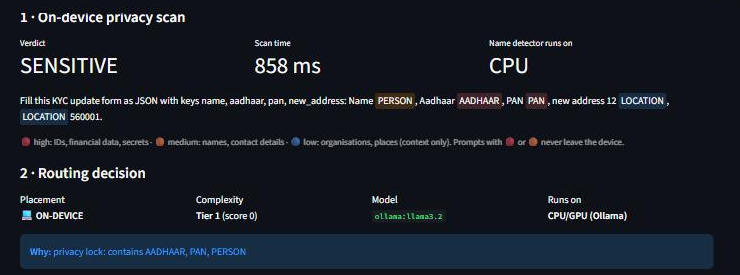
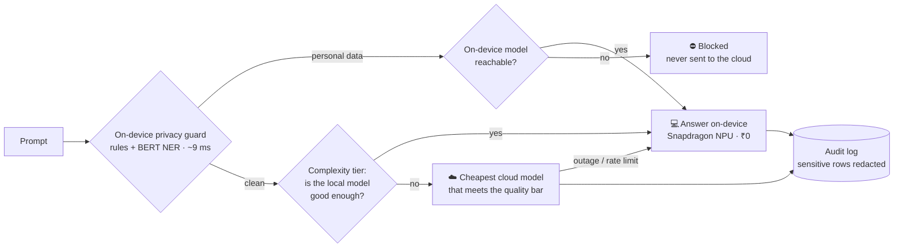
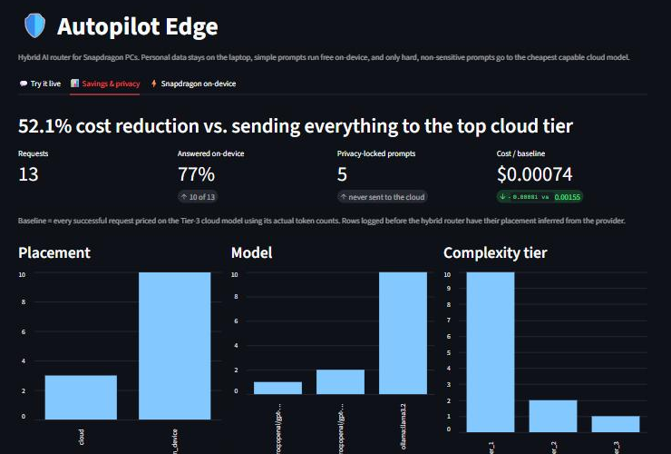

# 🛡️ Autopilot Edge

**A hybrid AI router for Snapdragon PCs: private by default, cloud only when it's worth it.**

[](https://github.com/Aadish2423/autopilot-edge/actions/workflows/tests.yml)

Autopilot Edge sits between your apps and AI models. For every prompt it runs an on-device
privacy scan, then decides what to do:
- **answer on the laptop**: free, private, works offline
- **pay for a cloud model**: only when the task really needs one

**Prompts containing personal data never leave the device.**

*Entry for the Snapdragon® AI Lab Build & Present Challenge. See the
[proposal](docs/PROPOSAL.md) and the [demo script](docs/DEMO_SCRIPT.md).*



---

## The problem

Most AI-powered apps send **every** prompt to a cloud model, which causes three problems:

| | Example | Consequence |
|---|---|---|
| 💸 **Cost** | "Convert this date to DD/MM/YYYY" goes to a frontier model | You pay per token for work a small free model can do |
| 🔓 **Privacy** | "Fill my KYC form: Aadhaar …, PAN …" goes to a third-party server | Personal data leaves the device, a compliance risk under India's DPDP Act, 2023 |
| 📡 **Availability** | The network or the provider goes down | The app stops working |

Snapdragon X PCs ship with a dedicated AI engine (the Hexagon NPU), but apps don't decide
**per prompt** when to use it and when to use the cloud. Autopilot Edge does.

## How it works



1. **Privacy guard** (`app/privacy/`), running on-device:
   - Rule detectors for Aadhaar (**Verhoeff checksum**), PAN, GSTIN, IFSC, UPI IDs, payment
     cards (**Luhn checksum**), bank and passport numbers, phones, emails, API keys and
     passwords.
   - A **BERT named-entity model** (ONNX) that finds people, organisations and places.
   - The checksums mean random numbers don't cause false alarms.
2. **Complexity classifier.** Each prompt gets a tier from 1 to 3, and each tier has a
   minimum quality bar.
3. **Hybrid router** (`app/router/hybrid.py`):
   - A sensitive prompt goes **on-device only**. If no local model is available, the request
     is **blocked (it fails closed)**.
   - A simple prompt runs on-device.
   - A hard prompt goes to the cheapest cloud model that clears the quality bar.
   - Fallbacks: a cloud failure is answered on-device, and an on-device failure (for
     non-sensitive prompts only) retries in the cloud.
4. **Explained and audited.** Every decision carries a plain-English reason. Privacy-locked
   prompts **and** their answers are stored redacted.

## Results

| Measurement | Result |
|---|---|
| Live run of 12 mixed prompts (`scripts/hybrid_demo.py`) | **12/12 answered · 75% on-device · 4/4 personal-data prompts kept local · 48.5% cheaper** than sending everything to the Tier-3 cloud model |
| Privacy guard on 28 hand-labelled prompts | **28/28 correct**: 0 missed, 0 false locks |
| Privacy scan latency | **~9 ms median** on CPU (Intel i5-12450H), before any NPU acceleration |
| Automated tests (`pytest`) | **42 passing**, including "personal data is never sent to the cloud, even when the local model fails" |



*Dashboard after the scripted run plus one live demo request.*

## Built for Snapdragon

| On-device component | Model | Snapdragon path |
|---|---|---|
| Privacy guard NER | dslim/bert-base-NER, 110M params, INT8 ONNX (MIT) | ONNX Runtime **QNN Execution Provider** → Hexagon NPU (`app/edge/accelerators.py` picks it automatically) |
| On-device language model | Phi-3.5-mini (MIT) | **Microsoft Foundry Local** serves the NPU (QNN) build (`foundry_local_provider.py`) |
| Fallback language model on any PC | Llama 3.2 3B via Ollama | CPU / GPU |

It's the same code on x86 and Snapdragon; only the runtime packages differ. On a
Snapdragon X PC:

```
pip uninstall -y onnxruntime && pip install onnxruntime-qnn   # privacy model → NPU
winget install Microsoft.FoundryLocal                          # language model → NPU
pip install foundry-local-sdk
foundry model run phi-3.5-mini
```

The router prefers Foundry Local (NPU) over Ollama automatically
(`config/hybrid_config.yaml`).

## Quickstart

```
git clone https://github.com/Aadish2423/autopilot-edge
cd autopilot-edge
python -m venv .venv
.venv\Scripts\activate
pip install -r requirements.txt
python scripts/download_models.py        # on-device privacy model, ~110 MB
ollama pull llama3.2                      # on-device language model (install Ollama first)
copy .env.example .env                    # optional: add GROQ_API_KEY for the cloud tier
streamlit run dashboard/app.py            # open the "Try it live" tab
```

- **No API keys?** Simple and sensitive prompts still work on-device.
- **No language model at all?** The privacy guard still works on its own:
  `python scripts/test_privacy_guard.py -v`

## API

Start the API with `uvicorn app.api.main:app`; interactive docs are at `/docs`.

| Endpoint | What it does |
|---|---|
| `POST /v1/completions` | Hybrid routing (default). Returns the answer plus `placement`, `routing_reason`, `privacy_categories`, `fallback`, cost and latency |
| `POST /v1/privacy/scan` | Runs the privacy guard only: findings plus a redacted copy. No model call, nothing logged |
| `GET /v1/on-device` | On-device runtimes, whether each is reachable, and the accelerators present |
| `GET /v1/stats` | Cost vs. baseline, % on-device, privacy locks |
| `GET /v1/models` · `PUT /v1/routing-config` | Model registry and live re-routing |

```
curl -X POST localhost:8000/v1/privacy/scan -H "Content-Type: application/json" \
     -d "{\"text\": \"Email priya.sharma@gmail.com the PAN ABCPE1234F\"}"
# → sensitive: true, redacted: "Email [EMAIL] the PAN [PAN]"
```

## Tests

```
pytest -q                                  # 42 tests; model calls are faked, no keys needed
python scripts/test_privacy_guard.py -v    # labelled privacy cases, with latency
python scripts/hybrid_demo.py              # live end-to-end run (needs Ollama; Groq key for cloud)
```

## Project structure

```
app/
  privacy/     detectors.py (rules + checksums) · ner.py (BERT NER) · guard.py (scan / redact)
  edge/        accelerators.py: ONNX Runtime sessions, Snapdragon NPU first
  router/      hybrid.py (on-device vs cloud) · classifier, cost predictor, verifier (Phases 2–6)
  models/      provider adapters incl. foundry_local_provider.py (Snapdragon NPU LLMs)
  logging/     SQLite audit log with redaction
  api/         FastAPI service
dashboard/     Streamlit app: Try it live · Savings & privacy · Snapdragon on-device
config/        hybrid_config.yaml · model_registry.yaml · routing_config.yaml
scripts/       download_models.py · hybrid_demo.py · test_privacy_guard.py · earlier demos
tests/         pytest suite
docs/          PROPOSAL.md · DEMO_SCRIPT.md · BUILD_LOG.md
```

## Honest limitations

- **Not yet run on Snapdragon hardware.** Development happened on an x86 laptop without an
  NPU, so both on-device models ran on the CPU. The NPU paths use the official runtimes
  (ONNX Runtime QNN EP, Foundry Local) but haven't been measured on-device yet.
- **Small local models are small.** That's why hard prompts go to the cloud. Local models
  also occasionally refuse or garble ID-heavy prompts.
- **The privacy guard targets English plus Indian identifiers.** Hindi and other Indic
  names are on the roadmap. The 28-case test set is a regression check, not an independent
  benchmark.

## Roadmap

1. Benchmark on a Snapdragon X PC: NPU latency, power, and share of prompts handled on-device.
2. Compile and profile the privacy model on Snapdragon X Elite via **Qualcomm AI Hub**.
3. An on-device embedding model on the NPU to replace the heuristic classifier and TF-IDF
   routing memory.
4. Multilingual (Indic) PII detection and an organisation-level privacy policy editor.
5. A local OpenAI-compatible proxy and tray app, so any desktop AI app gets hybrid routing
   with no code changes.

## Background

Autopilot Edge is Phase 12 of **LLM Cost Auto Pilot**, a cost-optimising LLM router built
over 11 earlier phases: unified providers, a complexity classifier, pre-call cost
prediction, explainable routing, multi-objective selection, quality verification, SQLite
logging, RAG compression, simulation, and a FastAPI service with Docker. The full
phase-by-phase record is in [docs/BUILD_LOG.md](docs/BUILD_LOG.md), and the original
write-up is in [CASE_STUDY.md](CASE_STUDY.md).

*Research and demonstration project. All identity numbers in this repo are synthetic.*
